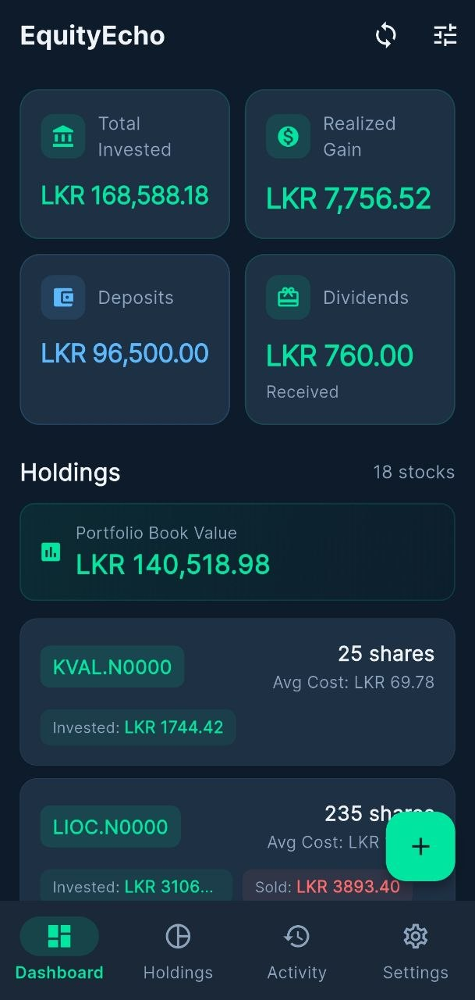
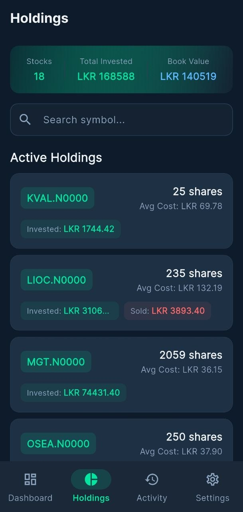
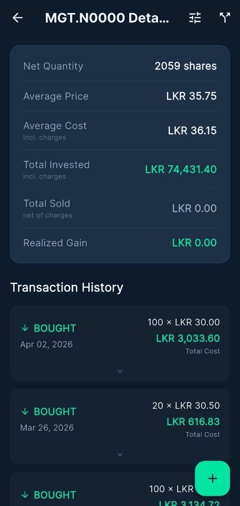
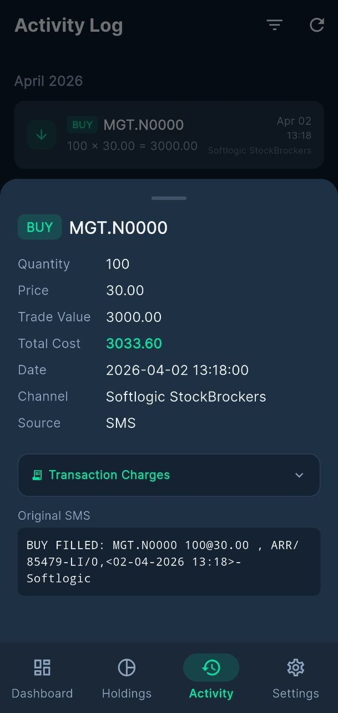
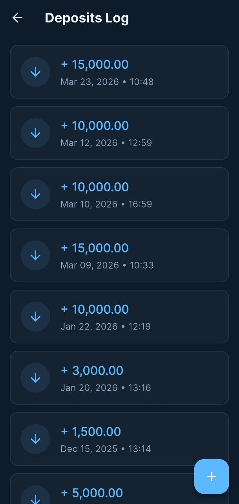
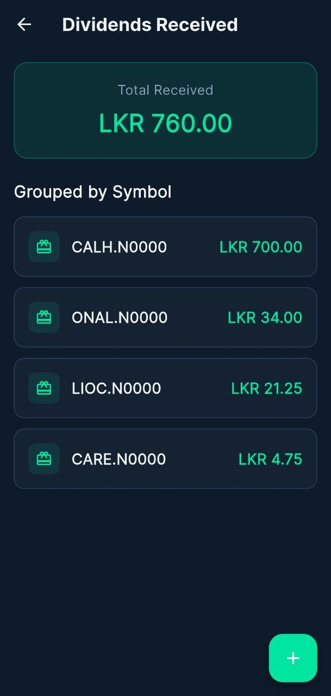
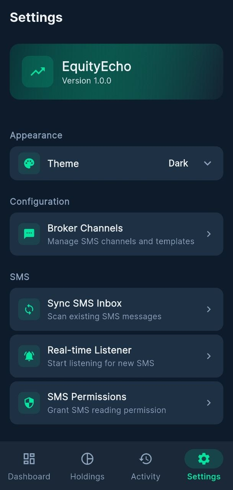
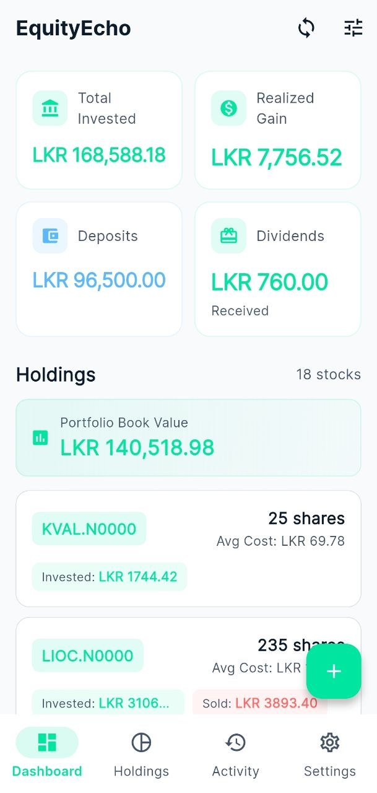
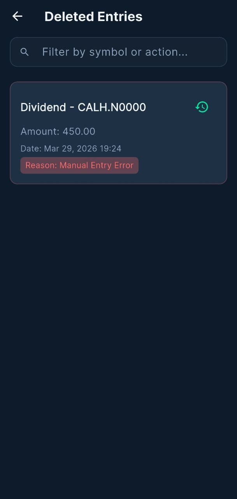

# EquityEcho 📈

> A Flutter app for tracking your equity portfolio on the Colombo Stock Exchange (CSE). EquityEcho automatically parses broker SMS messages to record trades and fund transfers, and gives you a clean dashboard view of your holdings, realized gains, and dividends.

---

## Screenshots

| Dashboard | Holdings | Holding Detail |
|-----------|----------|----------------|
|  |  |  |

| Activity | Deposits | Dividends |
|-----------|----------|----------------|
|  |  |  |

## Features

### 📊 Dashboard
The home screen gives you an at-a-glance overview of your portfolio:

- **Total Invested** — cumulative value of all buy trades.
- **Realized Gain/Loss** — profit or loss from closed positions, tappable to drill into the Realized Gains screen.
- **Deposits** — total funds deposited across all channels.
- **Dividends Received** — total dividend income.
- **Portfolio Book Value** — current cost-basis value of open holdings.
- **Holdings List** — cards for every stock you currently hold, with a separate *Past Holdings* section for fully exited positions.
- **Quick-add FAB** — floating button to add a Trade, an IPO Purchase, or a Fund Transfer without leaving the dashboard.
- **SMS Sync Button** — one-tap sync of your entire SMS inbox from the app bar.

---

### 📋 Holdings
A dedicated screen listing every stock you have traded, searchable by symbol:

- Summary header showing total stocks, total invested, and current book value.
- **Search bar** — filter holdings by symbol in real time.
- Active holdings and past (fully exited) holdings are shown in separate sections.
- Each holding card taps through to the **Holding Detail** screen.

---

### 🔍 Holding Detail
Per-symbol deep-dive screen:

- **Stats card** — shows book value, average cost, quantity held, and realized gain/loss for the symbol.
- **Transaction History** — chronological list of all buy/sell trades and stock sub-division events for the symbol.
- **Intra-day exemption badges** — trades matched as intra-day pairs are labelled `INTRA-DAY` and their charges are waived automatically.
- **IPO badge** — IPO purchases are clearly marked; transaction charges are not applied to IPO lots.
- **Adjustment badge** — manual holdings-correction entries are tagged `ADJUSTMENT`.
- **Add Trade FAB** — add a new trade pre-filled with the current symbol.
- **Adjust Holdings** — toolbar action to insert a correction entry that brings your recorded quantity in line with your actual holdings.
- **Add Sub-division** — toolbar action to record a stock split / sub-division event; the running quantity is automatically recalculated.
- **Convert Rights** — toolbar action (visible for rights symbols ending in `.R`) to convert a rights position into ordinary shares.
- **Delete with reason** — long-press any trade or split to soft-delete it with a mandatory delete-reason; deleted entries go to the Deleted Entries screen.

---

### 📅 Activity Log
A unified chronological feed of all trades and fund transfers:

- Entries are grouped by date.
- **Filter sheet** — filter by:
  - Type (All / Trades / Funds)
  - Year
  - Month
  - Symbol
  - Filter badge appears on the icon when filters are active.
- Tapping a trade entry opens a **detail bottom sheet** showing:
  - BUY/SELL badge, IPO/Intra-Day/Adjustment tags.
  - Quantity, price, trade value, total cost / net proceeds.
  - Collapsible **Transaction Charges breakdown** (Brokerage 0.64%, CSE 0.084%, CDS 0.024%, SEC Cess 0.072%, Share Transaction Levy 0.30% — 1.12% total).
  - Original SMS body (if synced from SMS).
  - Channel name and entry source (SMS vs Manual).

---

### 💰 Realized Gains
Lists all symbols where you have closed (or partially closed) a position:

- Sorted by highest gain first.
- Each row shows the symbol and the net realized gain/loss.
- Color-coded green (gain) / red (loss).
- Tap a row to open the Holding Detail screen for that symbol.

---

### 🏦 Deposits
Shows all fund deposit and withdrawal records across all broker channels.

---

### 🎁 Dividends
Track dividend income with full gross/net calculation:

- **Overview card** — total dividends received across all symbols.
- Dividends are **grouped by symbol**, sorted by highest total received.
- Tapping a symbol shows its full dividend history.
- **Add Dividend dialog**:
  - Symbol autocomplete (pulls from your existing holdings).
  - Number of shares + Dividend Per Share (DPS) input.
  - Tax deducted field — gross and net dividend calculated live.
  - Optional **"Reinvest as Deposit"** checkbox — automatically creates a matching fund deposit entry.
  - Date picker.
- Dividend history screen per symbol with soft-delete support.

---

### 📡 SMS Sync
The core automation feature of EquityEcho:

- **Batch sync** — scans your Android SMS inbox and processes messages from configured broker channels.
- **Real-time listener** — starts a foreground listener for new incoming SMS; newly matched messages are parsed and saved immediately.
- **Template-based parsing** — each SMS channel has configurable buy, sell, and fund-transfer templates using named placeholders (`{{symbol}}`, `{{quantity}}`, `{{price}}`, `{{amount}}`, `{{date}}`, `{{time}}`, `{{*}}`).
- **Default templates** — channels can opt-in to built-in default templates (no custom template required for common broker formats).
- **Progress dialog** — shows sync progress in real time.
- **Duplicate prevention** — already-processed messages are skipped.

---

### ⚙️ Channel Configuration
Each broker you trade with is modelled as a *Channel*:

| Field | Description |
|-------|-------------|
| Name | Friendly label for the broker (e.g., "Softlogic Stockbrokers") |
| SMS Sender Address | The SMS sender ID; a picker browses all unique senders in your inbox |
| Currency | LKR (default), USD, EUR, GBP, INR, AUD |
| Buy Template | Custom or default template for buy confirmation SMS |
| Sell Template | Custom or default template for sell confirmation SMS |
| Fund Transfer Template | Template for deposit / withdrawal SMS |

- **Default template toggle** — switch between using a built-in template or a custom one per action type.
- **Placeholder hints** — inline chips showing available placeholders.
- **Template Instructions** — expandable guidance on writing templates and using the wildcard `{{*}}` placeholder.
- **Template Test button** — test your template against a sample SMS to validate it before saving.
- **Delete channel** — deletes the channel config; existing trades and fund transfers are preserved.


---

### ✍️ Manual Trade Entry
Add or edit a trade without an SMS:

- BUY / SELL toggle with animated border highlight.
- Broker channel selector.
- Symbol input (auto-uppercased).
- Quantity and Price fields.
- **"Price includes charges"** switch — if your price already reflects brokerage, the app back-calculates the raw exchange price.
- Date and time pickers.
- **Live charges preview card** — shows Total Cost (buy) or Net Proceeds (sell) with an expandable breakdown of each fee component.
- IPO mode — same form pre-locked to BUY; charges are not applied; an IPO deposit fund entry is created automatically alongside the trade.

---

### 💵 Manual Fund Transfer Entry
Record a deposit or withdrawal manually with channel, action, amount, and date.

---

### 🗑️ Deleted Entries
Soft-delete safety net:

- All deleted trades, fund transfers, dividends, and stock splits are listed here.
- Each card shows the delete reason recorded at the time of deletion.
- **Search bar** — filter by symbol or action type.
- **Restore** button — reinstates the entry and refreshes the dashboard.


---

### 🎨 Appearance & Settings
- **Theme switcher** — Light, Dark, or System (follows OS preference). Setting persisted across app restarts.
- **SMS Permissions** — grant or check READ_SMS permission from within the app.
- **Clear & Re-sync** — wipe all trade/fund data and immediately re-scan the SMS inbox (useful after a template change).
- **Clear All Data** — permanently delete all trades and fund transfers (channel configs are kept).
- Navigation shortcuts to Broker Channels and manual entry forms.

| Settings | Light Theme | Deleted Entries |
|-----------|----------|----------------|
|  |  |  |

---

## Tech Stack

| Layer | Technology |
|-------|------------|
| Framework | Flutter (Dart) |
| State Management | flutter_bloc / Equatable |
| Local Database | Drift (SQLite) |
| Navigation | go_router |
| SMS Reading | another_telephony |
| Dependency Injection | get_it |
| Formatting | intl |
| Fonts | Google Fonts |
| Persistence (theme) | shared_preferences |

---

## Getting Started

### Prerequisites
- Flutter SDK `^3.11.3`
- Android device or emulator (SMS features are Android-only)

### Setup

```bash
# Clone the repository
git clone https://github.com/your-username/equity-echo.git
cd equity-echo

# Install dependencies
flutter pub get

# Run code generation (Drift)
dart run build_runner build --delete-conflicting-outputs

# Run on Android
flutter run
```

### First Run

1. Launch the app — you'll see the welcome empty state on the Dashboard.
2. Go to **Channels** (tune icon in the app bar) and tap **+** to add your broker.
3. Enter the broker name, SMS sender address (search your inbox with the 🔍 button), and configure templates.
4. From the Dashboard, tap the **Sync** icon to import your SMS history.
5. Your holdings, trades, and fund transfers will populate automatically.

---

## Architecture

```
lib/
├── core/
│   ├── constants/       # App-wide constants (default templates, DB name, charge rates)
│   ├── di/              # Dependency injection (get_it)
│   ├── services/        # SmsService, TemplateParser
│   ├── theme/           # AppTheme, ThemeCubit
│   └── utils/           # TransactionCharges calculator
├── data/
│   ├── database/        # Drift database definition + DAOs + migrations
│   └── models/          # Domain models (ActivityItem, HoldingSummary, …)
└── presentation/
    ├── blocs/           # BLoC / Cubit for each feature area
    ├── screens/         # One folder per screen; sub-folders for widgets/dialogs
    └── widgets/         # Shared widgets (StatCard, HoldingCard, ActivityTile, …)
```

---

## Privacy Policy

EquityEcho processes SMS messages **entirely on your device** — no data is ever transmitted to any server. Read the full [Privacy Policy](docs/PRIVACY_POLICY.md).

---

## License

This project is licensed under the GNU General Public License v3.0 — see [LICENSE](LICENSE) for details.

---

*Built with ❤️ for equity tracking on the Colombo Stock Exchange.*
